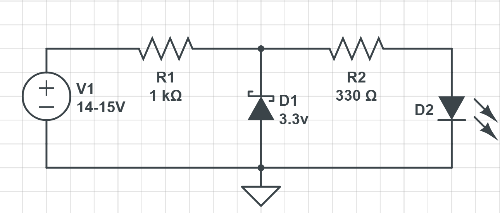
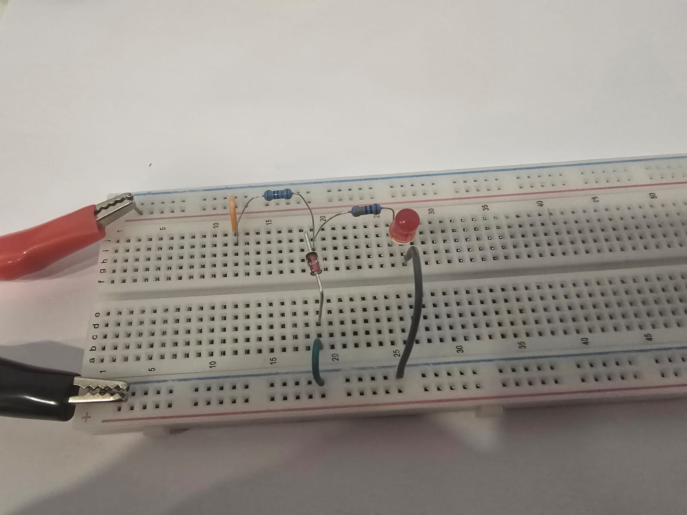
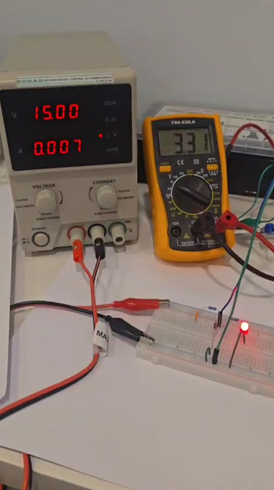
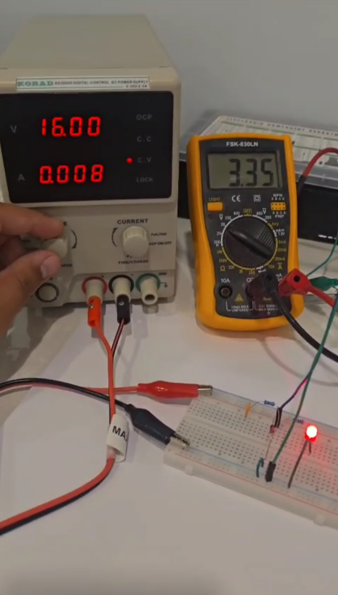
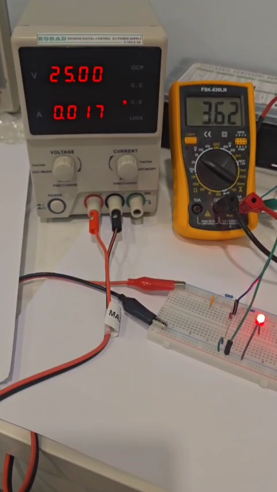
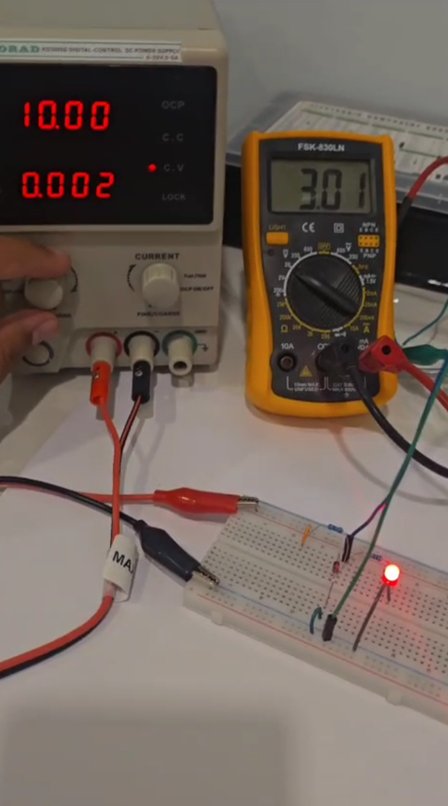

# Line regulator using Zener diode

## Description
This is a demonstration of the capability of regulating voltage using Zener Diode.
The Zener diode reverse voltage is (3.3V) and as known it will maintain this value even when a change in voltage occur.
For this demonstration  A load is connected parallel with Zener and the goal is to see the output voltage in the load whether it will change if the main power supply change or not.
The schematics of the circuit is shown below

## Circuit Diagram

### The Expermimnt
#### Higher Voltage
Here we will make zener face higher voltage and see if it could keep the voltage same.

The voltage from power supply is set to 15V and the output voltage in the Zener and the load is 3.31V, we can notice there's no huge difference in Zener.

The power source voltage value increased 1V (from 15-16v) and we see the output voltage in the Zener and the load increased just 0.04V.

Until the voltage reaches 25V (increased 10v) and yet the output voltage in the Zener diode and the load changed just ~0.3V as shown below.

#### Lower Voltage

For lower voltage demonstration, the power supply has been set from 15V to 10V and we got ~3.1V in zener output that's mean 5V drop from the source leaded only 0.3V drop in the Zener output.

## Conclusion
The Zener diode roughly could work as a regulator, also as shown in the experiments the Zener regulator regulating better in higher voltage than lower voltage.